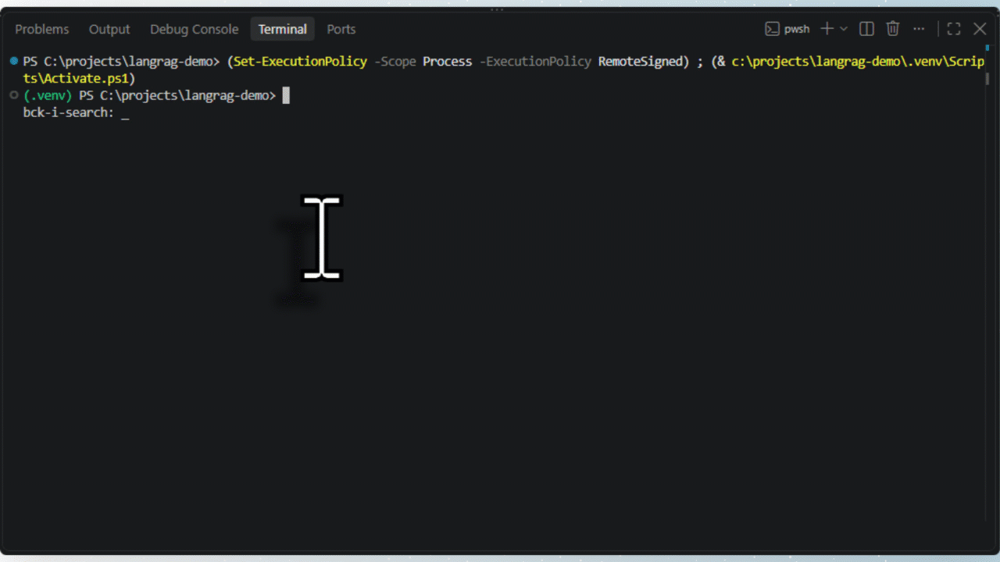

# Nimbus Docs RAG Demo



A small, deliberately generic LangChain + Ollama RAG demo — built to
show "I can do this in your stack" on Python/LangChain Upwork job
posts, without being tied to any one client's data or committing real
hours to an unpaid, one-off build for a specific job you might not win.

It answers questions about a fictional product's docs (`data/`),
grounded in retrieval, and returns which source file backed each
answer — the same underlying pattern as [ScopeSense](../scopesense),
just in the stack (LangChain, Chroma, FastAPI) that most Upwork
AI-agent postings actually ask for, rather than Go.

## Why this is worth having, specifically

Real open Upwork AI-agent/RAG postings consistently ask for things
like: "connect AI to our docs/wiki so it can answer questions, with
citations back to source" and judge submissions partly on "answer
quality, citation quality." This demo is built to speak directly to
that:

- **Grounded, not guessed** — the system prompt explicitly instructs
  the model to say so plainly rather than answer from outside
  knowledge if the context doesn't contain the answer.
- **Retrieval and generation are separate steps** in `app.py`, on
  purpose — that's what lets the response report exactly which source
  files backed the answer, rather than trusting the model to have
  used them faithfully.
- Runs entirely on local Ollama models (same `bge-m3` /
  `qwen2.5:7b-instruct` already used in ScopeSense) — no OpenAI API
  key needed for this demo to work.

## A note on how this was built

This was written without a working Python/LangChain environment to
actually run it in — no network access to install the packages, so it
hasn't been executed end to end yet. The code follows LangChain's
current (2026) recommended patterns: the dedicated `langchain-ollama`
and `langchain-chroma` packages rather than the older
`langchain_community` equivalents, and LCEL-style chains (`prompt |
llm | parser`) rather than the deprecated `RetrievalQA` class. Test it
yourself before relying on it in a client call — see Setup below.

## Setup

1. Make sure Ollama is running with the same two models ScopeSense
   uses:
   ```
   ollama pull bge-m3
   ollama pull qwen2.5:7b-instruct
   ollama serve
   ```
2. Install Python dependencies (a virtual environment is recommended):
   ```
   pip install -r requirements.txt
   ```
3. Build the vector store from the sample docs (run once):
   ```
   python ingest.py
   ```
4. Either run the API:
   ```
   uvicorn app:app --reload
   curl -X POST http://localhost:8000/ask -H "Content-Type: application/json" -d "{\"question\": \"How many automations can I have on the Team plan?\"}"
   ```
   Or test straight from the terminal, no HTTP needed:
   ```
   python query.py
   ```

## Using this in a proposal

- **Don't** rename this to a specific client's product and submit it
  as-is — the point is it's a fast, honest demonstration of the
  pattern, not a disguised claim of custom work already done for them.
- **Do** mention it directly: "I've built this exact RAG pattern —
  grounded retrieval with cited sources — in both Go (production
  service, live demo: [ScopeSense link]) and Python/LangChain (this
  demo). Happy to build against your actual docs on a paid contract."
- To adapt it for a real, won contract: drop the client's actual docs
  into `data/` (any text-based format — extend `ingest.py`'s loader
  for PDFs/HTML as needed), re-run `ingest.py`, and the same `app.py`
  works unchanged.
